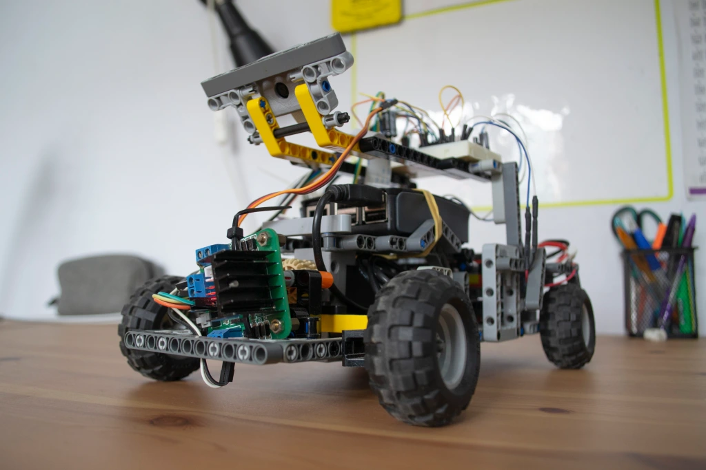

# Small Scale Self-Driving Car with Raspberry Pi

## Overview
This repository contains code used to train and test a small self-driving vehicle, powered by a Raspberry Pi. The vehicle is equipped with a front camera for lane detection and can be controlled with a remote control, for training purposes. This project is a passion project I did in 2020 during the COVID-19 lockdown and more details can be found here: https://endervastrobotics.wordpress.com/2020/05/09/self-driving-car-using-machine-learning-and-a-raspberry-pi/

## Training stage
The neural network is trained using the picture stream from the camera and the steering angle. An Arduino is used for the wireless communication between the remote and the car. During the training phase, a program called training.py is ran on the Raspberry Pi and the program takes a series of photos while recording the steering angle and associates the image with the steering angle using a csv file. A neural network based on Nvidia’s self-driving CNN architecture is then trained using the recorded images and steering angles. The architecture and image preprocessing steps can be seen in the Neural Network folder. 

## Testing stage
Once the model is trained, the car is ready to be ran. The Raspberry Pi loads the model and captures pictures continuously so that the model can predict the steering angle and it is then sent to the Arduino which will turn the servo controlling the steering. A short demonstration of the project can be seen here: 

https://www.youtube.com/watch?v=qMo_x_apfaA
